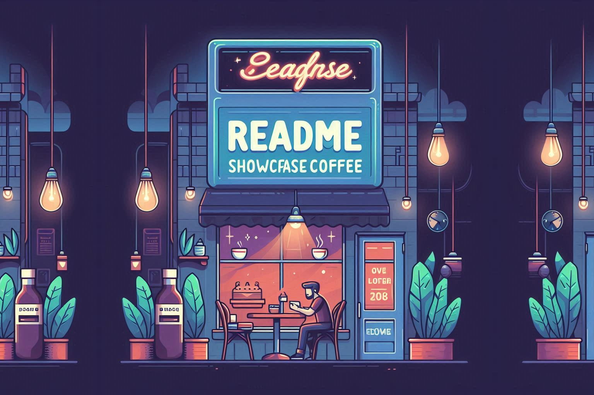

# Showcase Coffee ☕

<p>
  
</p>

Showcase Coffee is a modern and efficient software solution designed for managing
coffee shops and cafes. It provides tools to streamline operations, from handling suppliers
and stores to managing sales, purchases, and settlements. Built with React, Redux, and TypeScript, this frontend application ensures a seamless and responsive user experience.

## ✨ Key Features

- **Suppliers Management**: Easily manage and track suppliers
- **Stores Management**: Handle multiple coffee shop locations
- **Sales Management**: Track and manage sales transactions
- **Purchases**: Manage inventory and purchases
- **Settlements**: Handle payments and liquidations efficiently

## 🛠️ Technologies Used

- _Frontend_: React, Redux, React Router
- _Styling_: Tailwind CSS, shadcn/ui, and a touch of pure CSS
- _Development Tools_: Vite, ESLint, Prettier
- _HTTP Client_: Axios
- _UI Libraries_: Headless UI, Radix UI, Lucide Icons, Framer Motion
- _Form Management_: React Hook Form, Zod
- _State Management_: Redux Toolkit
- _Routing_: React Router DOM
- _Notifications_: React Hot Toast

## 🧩 Dependencies

### Core Dependencies

* **React**: Frontend library for building user interfaces
* **Redux**: State management library
* **React Router DOM**: Routing for the application
* **Axios**: HTTP client for API requests
* **Tailwind CSS**: Utility-first CSS framework
* **shadcn/ui**: UI component library

### Development Dependencies

* **Vite**: Fast build tool for modern web development
* **ESLint**: Linting tool for code quality
* **Prettier**: Code formatting tool
* **TypeScript**: Static type checking

For a full list of dependencies, check the `package.json` file.

## 📋 Prerequisites

Before running the project, make sure you have the following installed:

- [Node.js](https://nodejs.org/) (version 20 or higher)
- [Database]: Not required for the frontend. Connects to the Showcase Coffee API.
- [npm](https://www.npmjs.com/) (included with Node.js)

## 🗂️ Project Structure

```
src/
├── API/               # API-related utilities
|
├── assets/            # Static assets (images, styles)
|
├── components/        # Reusable components
│   ├── hooks/             # Custom hooks
│   ├── lib/               # Utility libraries
│   └── ui/                # UI components
|
├── context/           # React context providers
|
├── features/          # It contains the logic, services, and Redux state of each module.
│   ├── auth/              # Authentication logic
│   ├── companies/         # Handles providers and stores.
│   ├── dashboard/         # Handles dashboard-related logic
│   ├── images/            # Handles image uploads and management
│   ├── payments/          # Handles deposit and settlement.
│   ├── products/          # Handles brands, attributes, Products and variants
│   ├── transactions/      # Transaction management
│   └── users/             # Handles roles, users and employees
|
├── hooks/             # Custom hooks
├── layout/            # Layout components
├── pages/             # Application pages
├── routes/            # Application routes
├── store/             # Redux store configuration
├── types/             # TypeScript types
└── 
```

## 🔧 Environment Variables
Create a `.env.development` file in the root directory and configure the required variables:
```env
VITE_API_URL=http://localhost:3000
```

## ⚙️ Installation

Follow these steps to set up and run the project on your local machine:

1. **Clone the repository**:
```bash
git clone https://github.com/EncafeinadosCompany/showcase-coffee.git
cd showcase-coffee
```

2. **Install dependencies**:
```bash
npm install
```

## 🚀 Usage

Start Development Server:
```bash
npm run dev
```
*The application will be available at **[http://localhost:5173](http://localhost:5173)**.*

Build for Production:
```bash
npm run build
```

Lint Code:
```bash
npm run lint
```

Preview Production Build:
```bash
npm run preview
```

## 🔑 Default Credentials (for testing)
If you have run the seeders in the backend, you can log in using the following credentials:

- **Admin Store**
  - Email: admintienda@gmail.com
  - Password: Admin123.

## 🆘 Support

If you have any questions or suggestions, feel free to reach out:

* Email: your-email@example.com
* GitHub: your-username

Enjoy managing your coffee shops with Showcase Coffee! ☕✨
